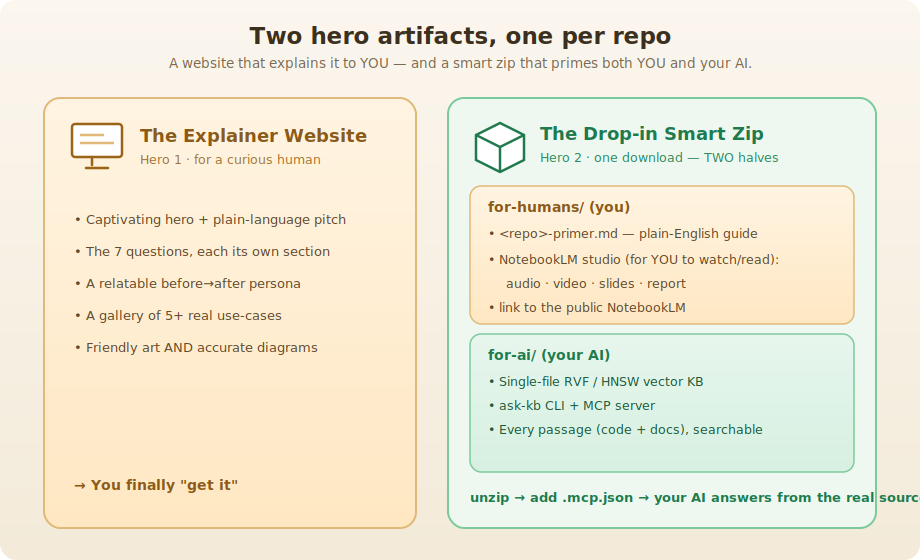
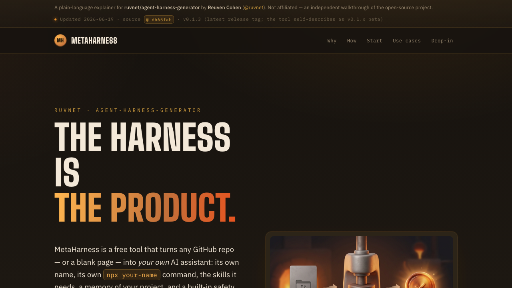
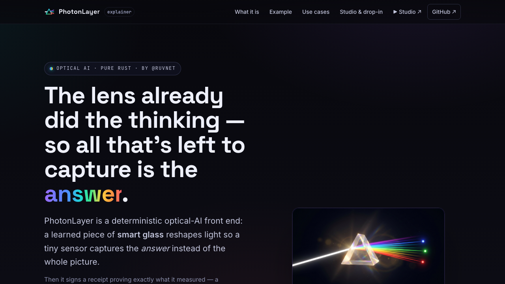
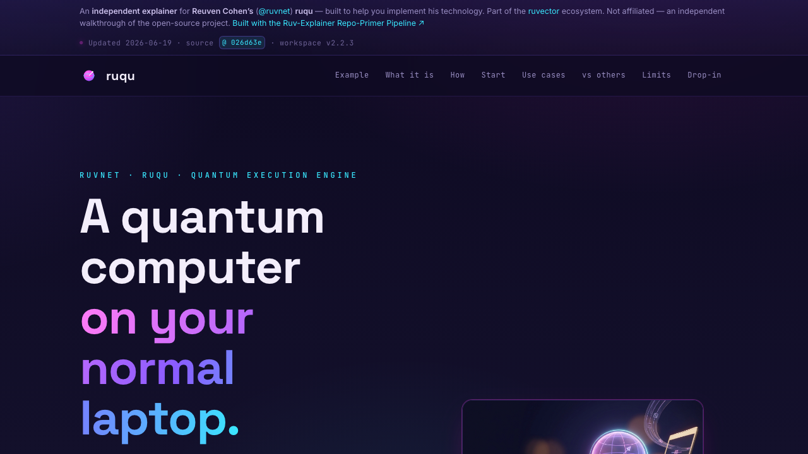
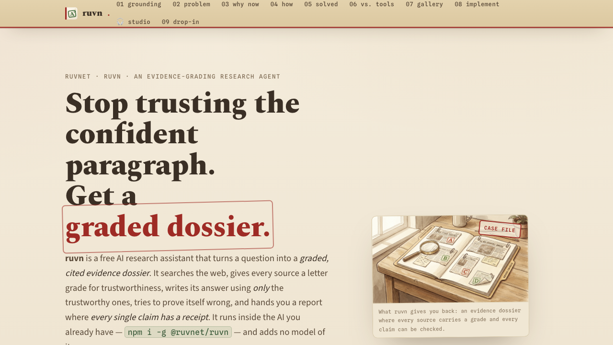
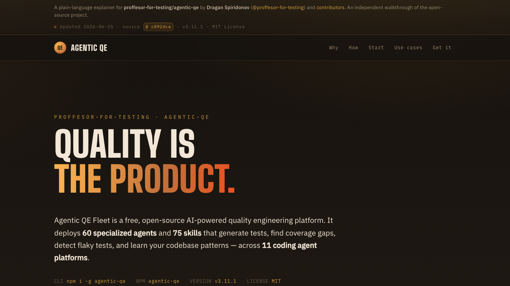
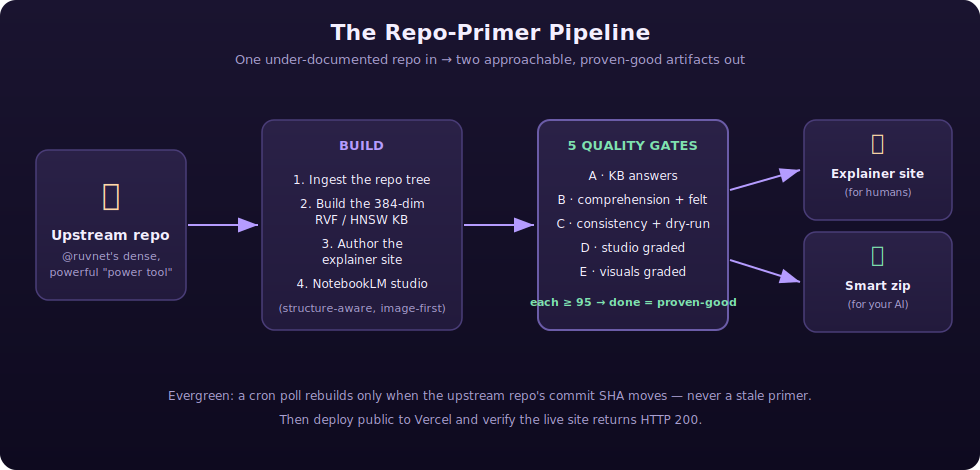

<div align="center">

# Repo Explainer

### Turn any GitHub repo into a visual, approachable explainer page — for humans *and* for your AI.

*Complex repos deserve clear introductions. This builds them.*


**[Try it now →](https://repo-explainer-six.vercel.app)**&ensp;·&ensp;**5 live explainers · [browse them below ↓](#-explainers-weve-built)**

</div>

---

## What is this?

You built something great and put it on GitHub. The problem: nobody understands it. Your README is written by someone who already gets it — for someone who already gets it. A newcomer lands on the repo, reads three paragraphs of jargon, and quietly closes the tab.

**Repo Explainer fixes that.** It's a repeatable pipeline that takes any GitHub repo and produces two things a newcomer actually needs:

1. **A beautiful explainer website** that teaches a curious human what the tool is, why they'd want it, and how to start.
2. **A drop-in "smart zip"** that makes their AI assistant instantly expert on that exact repo — no guessing, no hallucination.

> **How it works:** paste a GitHub URL → the pipeline reads the repo, builds a knowledge base, authors a visual explainer site, generates studio media (audio overview, infographic, report), runs 5 quality gates, and deploys the result to its own Vercel URL + GitHub repo.

---

## What does it produce?

Every repo gets **two hero artifacts**, both quality-gated:




<details>
<summary>Text version (for accessibility)</summary>

```
                   Two hero artifacts, one per repo

  HERO 1: THE EXPLAINER WEBSITE        HERO 2: THE DROP-IN SMART ZIP
  (for a curious human)                (one download — TWO halves)
  +---------------------------+        +--------------------------------------+
  | - Captivating hero + pitch|        |  for-humans/  (you)                  |
  | - Plain-language walkthru |        |   - Written primer                   |
  | - Before→after persona    |        |   - Studio media (audio, report,     |
  | - 5+ real use-cases       |        |     infographic)                     |
  | - Architecture diagrams   |        |  ------------------------------------|
  |                           |        |  for-ai/  (your AI assistant)        |
  | => You "get it"           |        |   - Vector knowledge base            |
  +---------------------------+        |   - Search CLI + MCP server          |
                                       |   - Every passage from the repo      |
                                       +--------------------------------------+
```

</details>

**(a) The explainer website — so a human gets it.**
A self-contained site that opens with a captivating visual and a one-sentence pitch, then walks through the questions a newcomer actually asks: *What is this? What problem does it solve? How does it work? How do I start?* It anchors on a relatable persona with a real before→after story, then shows concrete use-cases. No setup, nothing to install — read it like a short illustrated story.

**(b) The drop-in smart zip — so your AI gets it.**
A single download with two halves. The `for-ai/` half is a vector knowledge base of the repo's own code and docs, plus a search tool and Model Context Protocol (MCP) server you can wire into Claude Code or Cursor. The `for-humans/` half includes the written primer and studio media — an audio overview, an infographic, and a deep-dive report. Unzip it, add a two-line config, and your AI answers from the **real source** instead of guessing.

---

## 🖼️ Explainers we've built

Five live explainers — each its own public site and GitHub repo. Click a card to see it in action.

### MetaHarness

[](https://metaharness-explainer.vercel.app)

> **Gives any project its own AI assistant that actually knows *that* project — built in about a minute.** An AI assistant is a brilliant generalist, but out of the box it's never seen your code. MetaHarness hands your AI a memory of your project, the right skills, and guardrails — automatically.

🔗 [Live explainer](https://metaharness-explainer.vercel.app) · 📁 [Explainer repo](https://github.com/stuinfla/metaharness-explainer) · ⚡ [Source repo](https://github.com/ruvnet/agent-harness-generator) · 👤 [Reuven Cohen](https://github.com/ruvnet)

### PhotonLayer

[](https://photonlayer-explainer.vercel.app)

> **A deterministic optical-AI front end: a learned phase mask shapes light so a tiny sensor captures the *answer*, not the picture.** The optics themselves do part of the computation — at the speed of light, before any chip wakes up.

🔗 [Live explainer](https://photonlayer-explainer.vercel.app) · 📁 [Explainer repo](https://github.com/stuinfla/photonlayer-explainer) · ⚡ [Source repo](https://github.com/ruvnet/PhotonLayer) · 👤 [Reuven Cohen](https://github.com/ruvnet)

### ruqu

[](https://ruqu-explainer.vercel.app)

> **A fast quantum-computing simulator in Rust + WebAssembly — build and run quantum algorithms with no quantum hardware, right in your browser.**

🔗 [Live explainer](https://ruqu-explainer.vercel.app) · 📁 [Explainer repo](https://github.com/stuinfla/ruqu-explainer) · ⚡ [Source repo](https://github.com/ruvnet/ruqu) · 👤 [Reuven Cohen](https://github.com/ruvnet)

### ruvn

[](https://ruvn-explainer.vercel.app)

> **An AI research engine that turns a question into a graded, cited evidence dossier.** Instead of one confident paragraph, you get a structured report with sources gathered, weighed, and graded.

🔗 [Live explainer](https://ruvn-explainer.vercel.app) · 📁 [Explainer repo](https://github.com/stuinfla/ruvn-explainer) · ⚡ [Source repo](https://github.com/ruvnet/ruvn) · 👤 [Reuven Cohen](https://github.com/ruvnet)

### Agentic QE

[](https://agentic-qe-explainer.vercel.app)

> **A framework that replaces manual software testing with a fleet of AI agents — each one a specialist in a different kind of quality check.** Ship faster, catch more bugs, without a QA team bottleneck.

🔗 [Live explainer](https://agentic-qe-explainer.vercel.app) · 📁 [Explainer repo](https://github.com/stuinfla/agentic-qe-explainer) · ⚡ [Source repo](https://github.com/ruvnet/agentic-qe) · 👤 [Reuven Cohen](https://github.com/ruvnet)

---

## How it works — the Repo-Primer Pipeline

The whole point is that it's a **repeatable recipe**, not a one-off. Build one repo's explainer to a proven standard, then replay the identical pipeline on the next.



<details>
<summary>Text version (for accessibility)</summary>

```
                       The Repo-Primer Pipeline

 +-------------+     +------------------+     +-------------------+     +----------------+
 |  Any GitHub | --> |      BUILD       | --> |  5 QUALITY GATES  | --> | Explainer site |
 |   repo      |     | 1 ingest tree    |     |  A KB answers     |     |  (for humans)  |
 |             |     | 2 vector KB      |     |  B comprehension  |     +----------------+
 |             |     | 3 explainer site |     |  C consistency    |     | Smart zip      |
 |             |     | 4 studio media   |     |  D studio graded  | --> |  (for your AI) |
 +-------------+     |                  |     |  E visuals graded |     +----------------+
                     +------------------+     |  each >=95        |
                                             +-------------------+
```

</details>

Per repo, the pipeline:

1. **Ingests the repo** — reads the code tree, skipping vendored or submodule code so the explainer teaches *this* tool only.
2. **Builds a vector knowledge base** — embeds the repo's code and docs locally (384-dimensional, structure-aware chunking at function/heading boundaries).
3. **Authors the explainer site** — image-first design, with dual-level visuals (a friendly illustration *and* an accurate architecture diagram per section), a relatable before→after persona, and prominent attribution to the original author.
4. **Generates studio media** — audio overview, infographic, and deep-dive report, all built from the repo's own content.
5. **Runs 5 quality gates** — and only declares "done" when every gate passes with evidence.
6. **Deploys** — to its own GitHub repo + Vercel site, then verifies the live URL returns HTTP 200.

### The 5 gates — "done = proven-good"

The hard-won rule: **"done" never means "the files exist."** The build evaluates its own output and only passes when every gate clears its bar.


<details>
<summary>Text version (for accessibility)</summary>

```
              The 5-Gate Self-Evaluating Quality System

  +------------+   +--------------+   +-------------+   +-------------+   +-------------+
  |     A      |-> |      B       |-> |     C       |-> |     D       |-> |     E       |-> DONE
  | KB answers |   | comprehension|   | consistency |   |   studio    |   |  visuals    |
  | query the  |   | walk the     |   | no invented |   |   graded    |   |  graded     |
  | real KB;   |   | live site:   |   | APIs; links |   | audio +     |   | every image |
  | score >=95 |   | "do I want   |   | resolve;    |   | report      |   | friendly +  |
  |            |   |  this?"      |   | dry-run     |   | teach a     |   | accurate    |
  +------------+   +--------------+   +-------------+   | beginner    |   +-------------+
                                                        +-------------+
  The headline score = the LOWEST gate. A primer is only as done as its weakest gate.
```

</details>

| Gate | What it checks | How it passes |
|---|---|---|
| **A — KB answers** | The vector knowledge base is queried with test questions; graded on retrieval relevance + answer correctness vs. source. | Score ≥ 95 on both tuned and held-out question sets. |
| **B — Comprehension** | A reviewer walks the live site as a newcomer — then answers: *Does this impress me? Invite me in? Make me want to use it?* | All three questions answered "yes." |
| **C — Consistency** | Claims grounded in source (no invented APIs), all sections present, ≥5 use-cases, links resolve, smart zip loads correctly. | Pass / fail. |
| **D — Studio graded** | Audio + report are reviewed for clarity, comfort, confidence, and completeness. | Score ≥ 95. |
| **E — Visuals graded** | Every image is checked — must include both a friendly on-ramp *and* an accurate architecture diagram. | Score ≥ 95. |

The standard bar is **≥ 98**; ≥ 95 is acceptable under time pressure.

---

## Build your own

**Option 1: Use the website**
Paste a GitHub URL at [repo-explainer-six.vercel.app](https://repo-explainer-six.vercel.app) and the pipeline builds it for you.

**Option 2: Run the pipeline yourself**

1. **Configure the target** — add a per-repo config under [`config/repos/`](config/repos/).
2. **Build + grade the knowledge base** — the scripts in [`kb/`](kb/) build the vector DB and grade it (Gate A).
3. **Build + gate the site** — author the explainer (image-first, dual-level visuals, persona), run Gates B/C/E.
4. **Generate studio media** — audio overview, infographic, report. Grade them (Gate D).
5. **Deploy + verify** — ship to its own GitHub repo + Vercel site, verify HTTP 200.

---

## When an explainer is built for your repo

Each explainer is **its own separate project** — a standalone GitHub repo and Vercel site that belongs to you:

- **Your own GitHub repo**: `your-username/yourproject-explainer`
- **Your own Vercel URL**: `yourproject-explainer.vercel.app`
- **Your own files**: HTML, CSS, images, studio media, knowledge base — everything self-contained
- **No shared infrastructure**: nothing depends on any other explainer or on this pipeline repo

You get invited as a collaborator on the explainer repo, and a pull request is opened on your original repo's README to add a badge linking to the explainer:

```markdown
[](https://yourproject-explainer.vercel.app)

> **New here?** This repo has a [visual explainer page](https://yourproject-explainer.vercel.app) —
> a plain-language walkthrough with architecture diagrams, audio overview, and a
> downloadable knowledge pack for your AI assistant.
```

You can merge, edit, or close the PR — it's your repo, your call.

---

## Tech stack

| Layer | Tool | Why |
|---|---|---|
| **Vector knowledge base** | RVF single-file HNSW vector DB | One file, zero server, zero Docker. Drops into any project. |
| **Embeddings** | `bge-small-en-v1.5` (384-dim, local) | Strong retrieval, runs on a laptop, no external API. |
| **Studio media** | Google NotebookLM | Audio overview + report that teach a true beginner. |
| **Image generation** | OpenAI gpt-image-1 | Hero images and section illustrations. |
| **Hosting** | Vercel | Git-connected, auto-deploy, instant preview URLs. |
| **Orchestration** | Ruflo | Capacity-aware parallel swarms for building multiple explainers. |
| **Site design** | Image-first, dual-tier visuals, hand-authored SVG diagrams | Meets both a newcomer and a technical reader in the same section. |

---

## Credit

The tools explained in the gallery above belong to [Reuven Cohen / @ruvnet](https://github.com/ruvnet). All credit for the underlying technology — MetaHarness, PhotonLayer, ruqu, ruvn, and Agentic QE — is his. Repo Explainer is an independent project that exists to help more people discover, understand, and adopt great work.

---

<div align="center">

**[Repo Explainer](https://repo-explainer-six.vercel.app)** · [github.com/stuinfla/repo-explainer](https://github.com/stuinfla/repo-explainer)
*Complex repos deserve clear introductions.*

</div>
