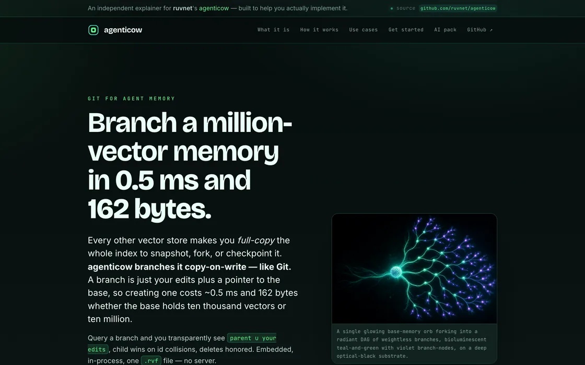
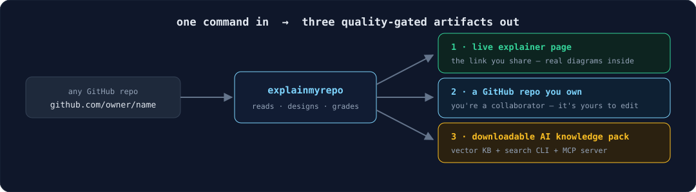
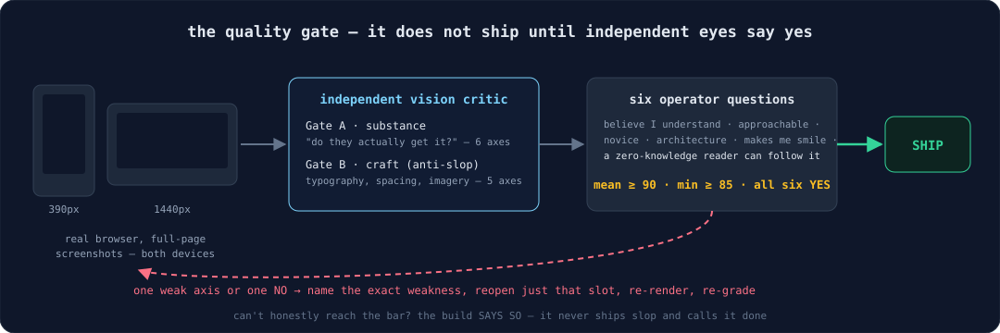
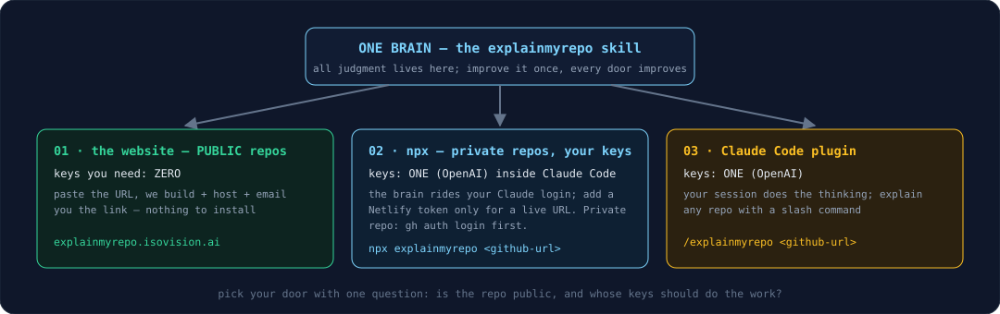
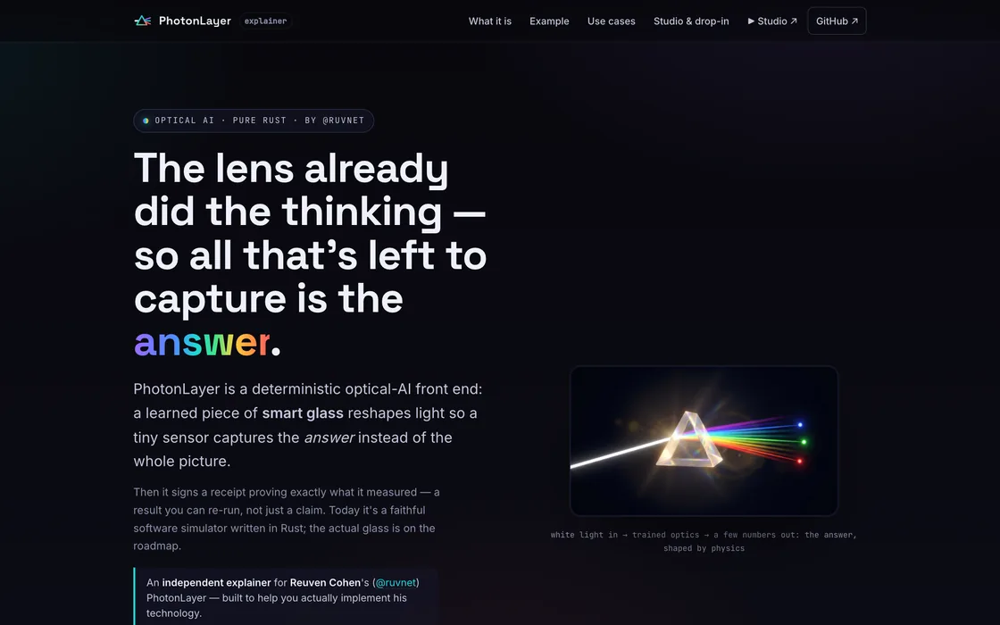
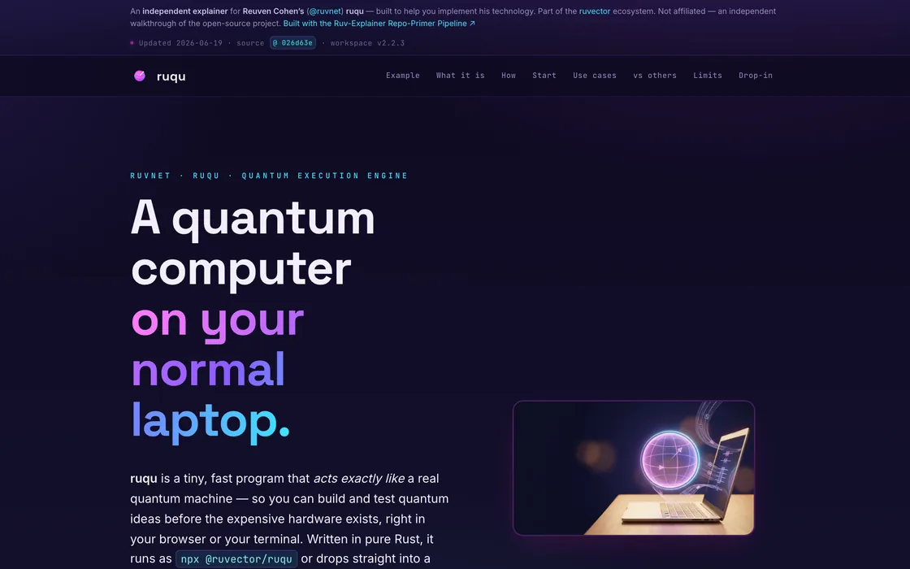
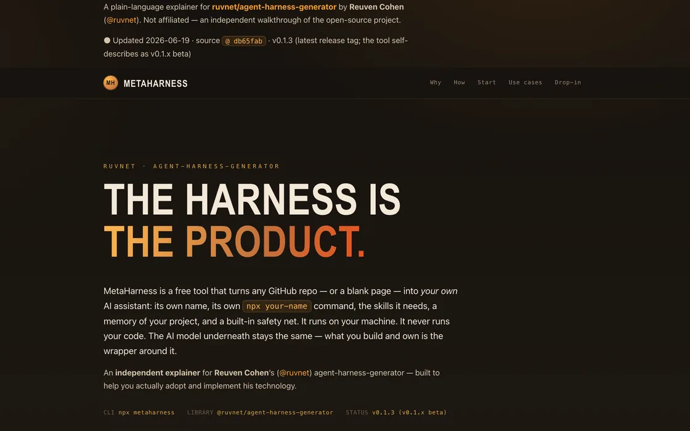
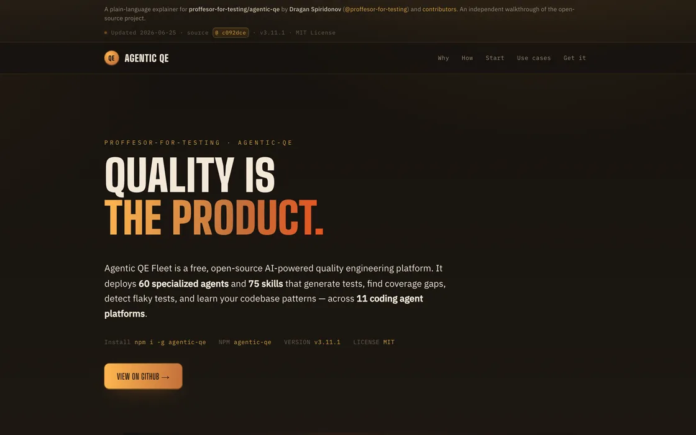

<div align="center">

# explainmyrepo

### Point it at any GitHub repo. Get back an explainer a stranger — and their AI — actually understands.

## 🌐 The website — there is only ONE

# → **[explainmyrepo.isovision.ai](https://explainmyrepo.isovision.ai)** ←

This is the live site: the concept, the full process, and all six example explainers on one page.

> **Heads up:** the old `repo-explainer-website.vercel.app` was an earlier draft that told people to run a command (`npx repo-explainer`) that was never published. It now **redirects here**. If you ever land on anything other than **explainmyrepo.isovision.ai**, you're on the wrong (old) page.

*Complex repos deserve clear introductions. This builds them, then refuses to ship until they're good.*

</div>

[](https://agenticow-explainer.netlify.app/)

<p align="center"><em>↑ a real one — generated end to end from <a href="https://github.com/ruvnet/agenticow">ruvnet/agenticow</a>, no human design pass. <a href="https://agenticow-explainer.netlify.app/">Open it live.</a></em></p>

---

## The problem it solves

Most repositories are opaque. Open one cold and you can't quickly tell **what it is**, **why it matters**, **how it's built**, or **how to use it**. The README is usually a wall of text written by someone who already knows the answer — so it assumes you do too.

That hurts twice over now:

- **A human** lands on your repo, doesn't get it in thirty seconds, and leaves.
- **An AI** (Claude Code, Cursor) is asked about your repo and *guesses*, because it has no grounded understanding of the actual source.

A longer README doesn't fix opacity. The goal is bigger than documentation:

> Take someone from *"I've never seen this before"* to *"Oh, I get why this was created, the problem it solves, what it does, why it's elegant, how it works — and I'm ready to go implement it."*

That's the bar. `explainmyrepo` exists to clear it, on every build.

---

## What you get — three artifacts from one command

One command reads a repo and produces three things, each quality-gated:



1. **A live explainer web page** — the link you share. A bespoke, art-directed walkthrough with a real architecture diagram and a real data-flow diagram drawn from the code itself.
2. **A GitHub repo you own** — you're invited as a collaborator on the explainer's own repo, so you can edit it. It's yours.
3. **A downloadable AI knowledge pack** — a drop-in `.zip` containing a vector knowledge base of the repo, a search CLI, and an MCP server, so Claude Code or Cursor answer from the **real source** instead of guessing.

---

## How it works — the process

`explainmyrepo` is not a template filler and not a doc scraper. It's a single Claude Code **skill** that holds the judgment (the *brain*) plus small, pure **tools** that do the mechanics — with one data contract flowing between them. No brittle multi-phase pipeline.

The brain runs the repo through an ordered sequence. Each step has one job:


1. **Read** — clone the **exact** repo (identity-pinned, so nothing can substitute a lookalike) and **live-probe every credential** before a cent is spent: the preflight walks each key's candidate sources and self-heals onto the first one that actually works.
2. **Compete** — before any expensive work, **three frontier models fight in plain text** (Claude Sonnet, Claude Fable, GPT-5.6) to art-direct this repo: each pitches a visual metaphor, palette, hero animation, and story arc; an independent judge scores them swap-test-first and the winner's concept seeds the build. Premium creative judgment at *pennies*, so the expensive execution runs once, on the cheaper tier.
3. **Understand** — build a real RVF vector knowledge base from the actual code: structure-aware chunks, local 384-dim embeddings (`bge-small-en-v1.5`), plus an extracted symbol index, dependency graph, and entrypoints. Then author a plain-language primer. Everything downstream is grounded in this KB — **no invented capabilities**.
4. **Conceive** — validate the tournament's winning concept against the full KB and sharpen it with grounded specifics. The truth rails stay with the agent; the creativity already won its seat.
5. **Author** — write the copy along a **comprehension arc** — the questions a newcomer actually asks, in order: *What world am I in? Why does this exist? What does it do? Why is it clever? How is it built? Could I use it? How do I start?* Every claim is traceable to a KB passage.
6. **Visualize** — every image must **teach** (the swap test: if an image could ship unchanged on a different repo, it fails). Labeled, mechanism-bearing illustrations via `gpt-image-2`/Grok; **bespoke *animated* SVG diagrams** hand-authored per an archetype menu (journey · containment · field · fan · tree · exchange — **no two diagrams on one page may share a form**), with every label width-budgeted so text can never collide. The flow diagram must *perform* the repo's thesis in motion, not name stages. Architecture and data-flow diagrams are mandatory and drawn from the repo's *real* dependency graph — never invented.
7. **Assemble** — render the page **once** onto a shared design system (with universal click-to-zoom on every figure), build the downloadable AI knowledge pack, and wire in SEO + social (JSON-LD, a 1200×630 social card, `llms.txt` for AI crawlers).
8. **Grade** — the quality gate (see below). Real screenshots, both devices, every diagram at full size, and **animations sampled at multiple loop phases and judged at their worst frame**.
9. **Ship** — the gate's verdict is enforced as a **deterministic rail at the deploy boundary** (its only override is human-only, terminal-gated — an agent cannot reach it). A refused build isn't garbage: it survives as an artifact with the grader's own words, and the runner can spend one trusted "operator's grade" on a documented post-cap fix. On success: deploy, verify HTTP 200, update the public status page with the full scorecard, and email you every link — including a one-click **grade-this-page** ask.

---

## The quality gate — why the output is a class above

This is the part that makes the difference. A generic generator emits something and stops. `explainmyrepo` **does not ship until an independent critic and a set of operator questions both pass.**



The gate renders the live page in a real browser at **390px (mobile)** and **1440px (desktop)**, takes full-page screenshots, and scores them on **two independent rubrics**:

- **Gate A — "Do they actually get it?"** (substance): visual effectiveness, storytelling, clueless-to-convinced, usefulness-to-*you*, completeness of the arc, and implementation confidence.
- **Gate B — "Did someone who gives a shit make this?"** (craft / anti-slop): typography, alignment, spacing, polish, and imagery craft — including whether the diagrams are genuinely explanatory.

The bar has **two tiers, both enforced in code**: the **exemplar bar** (mean ≥ 90, minimum axis ≥ 85, both devices) is what the refine loop climbs toward, and the **ship floor** (mean ≥ 82, minimum axis ≥ 70, all operator questions YES) is a hard rail at the deploy boundary — `deploy` recomputes it from the scorecard and refuses anything below it, no matter what any agent believes. The minimum-axis floor is the anti-slop catch: one weak axis (a raw ASCII diagram, a mood image that fails the swap test, an animation whose *worst sampled frame* has colliding text) fails the whole build. Every image is individually interrogated — what does a stranger learn from its pixels alone, and could it ship unchanged on a different repo?

On top of the numbers, the operator must answer **YES to all six questions** — a separate, independent gate:

1. Would this make me believe I understand this?
2. Would this make it approachable?
3. Would this explain it for somebody who doesn't understand it?
4. Would it give me confidence I understand the architecture?
5. Does it make me smile — "oh, that's cool"?
6. Could someone who knows **nothing** about this domain read the first four sections and explain the problem and the solution back to me?

A single axis below the bar, or a single NO, names the exact weakness, reopens just that slot, re-renders, and re-grades. **Iterating over a few revisions is expected by design** — it's how the build climbs to genuinely high quality. Three sets of eyes see the same pixels: the vision-model critic, the operator, and finally you (the owner) on delivery. If a repo genuinely can't reach the bar, the build **says so honestly** rather than shipping slop and calling it done — and the honest refusal is preserved (site + scorecard + the grader's reasons) so a ten-minute cure beats a rebuild.

---

## The factory learns — every build makes the next one better

Most generators are amnesiac: build #100 is exactly as naive as build #1. This one closes the loop:


- **Two verdicts per page, side by side**: the machine grader's scorecard *and* the reader's own 1–100 + comments (every delivery email asks for it). The admin dashboard plots the synthesized score over time — the factory has to prove it's getting better, not claim it.
- **Only measured truth is promoted**: build outcomes and human grades land in an oracle-tier learning store; patterns distilled from it are marked trustworthy only when execution-observed.
- **Lessons live in the recipe, not in anyone's memory**: when a failure teaches something (an animation that hid its worst frame, a label that collided at column scale, a $0 pre-check that burned real grade budget), the *skill, the gate, or a tool* is changed the same day — so the fix fires on every future build even when nobody remembers the incident.

The receipts are in the git log: the first fully-autonomous build after this week's lessons went **first-try exemplary — one grade pass, 37 minutes, zero human minutes**.

---

## One brain, three doors

The judgment lives in **one** place — a Claude Code skill. The same core is exposed through three thin adapters that each run the *identical* skill; none of them contains explainer logic of its own. Improve the brain once, and it improves everywhere.



- **Hosted website** — paste a GitHub URL in the browser. **Public repos, zero setup** — the easiest door.
- **npx CLI** — the one-liner below. **Private repos and your own keys.**
- **Claude Code plugin** — run it from inside Claude Code with a slash command.

**Pick your door with one question — is the repo public, and whose keys should do the work?**
Public repo and you just want the page: use the website, done. Private repo, or you want it on
your own accounts: use the CLI — and run it **inside a VS Code / Claude Code session**, in a
project whose `.env` already holds your keys, so everything is picked up automatically.

---

## Get started

```bash
# Point it at any GitHub repo. Walk away. Get back a live page, a repo you own, and an AI pack.
npx explainmyrepo https://github.com/owner/repo
```

**What you need** (the command checks all of this up front and tells you exactly what's missing):

| For | What | Notes |
|---|---|---|
| The brain | `OPENROUTER_API_KEY`, **or** `ANTHROPIC_API_KEY`, **or nothing** if you're logged into Claude Code | any one of the three is enough. With an OpenRouter key the authoring runs on `z-ai/glm-5.2` — measured 15× cheaper than Sonnet 5 *and* higher-scoring on a blind art-direction A/B. Pin the old model with `EXPLAINMYREPO_AUTHORING=anthropic` |
| Art + quality gate | `OPENAI_API_KEY` in `.env` | hero imagery and the vision grader |
| **ImageMagick** | `magick` (v7) or `convert` (v6) on your `PATH` | **required** — the favicon station shells out to it and fails loudly without it. `brew install imagemagick` on macOS, `apt install imagemagick` on Debian/Ubuntu |
| The live URL | `NETLIFY_AUTH_TOKEN` in `.env` — optional | skip with `--no-deploy` and you still get the complete page locally |
| Private repos | `gh auth login` | public repos need nothing |

**The count, plainly:** website — **zero keys**. npx **inside Claude Code** (recommended) —
**one key** (OpenAI); add a Netlify token only if you want the live URL. npx in a bare
terminal — **two keys** (add Anthropic). Private repo — no extra key, just `gh auth login` once.

**Recommended:** run it inside a **VS Code / Claude Code session** in a project whose `.env`
already has these — nothing to export, nothing to paste, and Claude Code itself carries the
brain on your existing subscription. In a bare terminal it works too; you'll just be told up
front which keys to add.

**What happens:** it reads the repo, understands it, art-directs and writes the page, generates the imagery and the real architecture + data-flow diagrams, grades the result on mobile and desktop until it clears the bar, then deploys it.

**What you get back:** a live URL (in your terminal and by email), a GitHub repo you're a collaborator on, and the downloadable AI knowledge pack — plus the scorecard and both screenshots, so you're the final set of eyes.

> **Status:** `npx explainmyrepo` is **live on npm** (v0.2+). The hosted website is live at [explainmyrepo.isovision.ai](https://explainmyrepo.isovision.ai). Found it valuable? **[A star on this repo](https://github.com/stuinfla/Repo-Explainer)** genuinely helps. Hit a problem? **[Open an issue](https://github.com/stuinfla/Repo-Explainer/issues)** — happy to help fix it and make it better.

**Don't want to pay per token for the authoring brain?** The same skill runs through a **Codex** session signed in with a ChatGPT subscription, which drops the text-model cost to $0 (only `gpt-image-2` imagery stays metered, at cents per build). It also builds straight from a **local checkout**, so private source never leaves the machine. See [`docs/prompts/codex-explainer-build.md`](docs/prompts/codex-explainer-build.md) for the setup and a copy-paste prompt template.

---

## See a real one

The agenticow explainer below was generated end to end from [`ruvnet/agenticow`](https://github.com/ruvnet/agenticow): a captivating hero, a plain-language walkthrough, **a real architecture diagram and data-flow diagram drawn from agenticow's own code**, concrete use-cases, and a one-click AI knowledge pack.

### [Open the live agenticow explainer →](https://stuinfla.github.io/Repo-Explainer/agenticow/)

The bar these are calibrated against — five hand-built explainers, five completely different looks, same engine, same gate:

| | | |
|---|---|---|
| [](https://photonlayer-explainer.vercel.app/) | [](https://ruqu-explainer.vercel.app/) | [](https://ruvn-explainer.vercel.app/) |
| [**PhotonLayer**](https://photonlayer-explainer.vercel.app/) — optical-AI: light computes the answer before any chip wakes up. | [**ruqu**](https://ruqu-explainer.vercel.app/) — a quantum-computing simulator in your browser (Rust + WASM). | [**ruvn**](https://ruvn-explainer.vercel.app/) — turns a question into a graded, cited evidence dossier. |
| [](https://metaharness-explainer.vercel.app/) | [](https://agentic-qe-explainer.vercel.app/) | [](https://agenticow-explainer.netlify.app/) |
| [**MetaHarness**](https://metaharness-explainer.vercel.app/) — gives any project its own AI assistant that knows *that* project. | [**Agentic QE**](https://agentic-qe-explainer.vercel.app/) — replaces manual testing with a fleet of specialist AI agents. | [**agenticow**](https://agenticow-explainer.netlify.app/) — git for agent memory: copy-on-write vector branching. |

---

## Built with

| Layer | Tool |
|---|---|
| Concept tournament | Claude Sonnet 5 · Claude Fable 5 · GPT-5.6 competing in text; GPT-5.6 judging |
| Knowledge base | RVF single-file vector DB (`@ruvector/rvf`) + `bge-small-en-v1.5` (local, 384-dim) |
| Imagery | `gpt-image-2` / Grok (labeled, mechanism-bearing illustration) + bespoke hand-authored **animated SVG** diagrams (archetype-diverse, width-budgeted) |
| Quality gate | Playwright dual-viewport render + GPT-5.6 vision grading (configurable) — every diagram at full size, animations at their worst sampled frame, ship floor enforced as a deploy rail |
| Feedback + learning | Reader 1–100 grades beside machine grades on the admin; outcomes + grades feed an oracle-tier learning store |
| Companions (local) | [HyperFrames](https://github.com/heygen-com/hyperframes) — the page's own gated assets re-rendered into a 30–40s trailer and a 10s social loop (16:9 + 9:16), locally, for ~$0 |
| Hosting | Netlify by default (provider-agnostic adapter) |

The full recipe lives in [`docs/adr/0005-skill-based-explainer-recipe.md`](docs/adr/0005-skill-based-explainer-recipe.md); the domain model in [`docs/ddd/explainmyrepo-recipe-domain.md`](docs/ddd/explainmyrepo-recipe-domain.md).

## The Alive Kit — what a finished page can become (local runs only)

A gated build's assets are reusable creative truth, so this repo can turn a finished
explainer into **companion artifacts** — but only when you clone it and run them yourself,
and only for capabilities that have actually been **proven**:

```
npx explainmyrepo capabilities
```

That command renders the verified-capability registry (`capabilities.json`) — the *only*
source of what's enabled, so it can never overstate. Today it shows two ✓ (a shareable
**trailer** and a 16:9 + 9:16 **social loop**, each verified end-to-end with recorded
receipts, ~$0 to render) and two ○ that are specified but honestly *not enabled* until
they pass their own supervised verification runs. Companions never run on the hosted door,
never touch a build's artifacts, and can never block a page from shipping. Governance:
[`docs/adr/0009-alive-kit-local-companions.md`](docs/adr/0009-alive-kit-local-companions.md).

---

## Credit

The tools in the examples above belong to [Reuven Cohen / @ruvnet](https://github.com/ruvnet). `explainmyrepo` is an independent project that exists to help more people — and their AIs — discover, understand, and adopt great work.

---

<div align="center">

Built by **[Stuart Kerr](https://stuart-kerr-card.netlify.app)** at **[ISOvision.ai](https://isovision.ai)**.

*Complex repos deserve clear introductions.*

</div>
